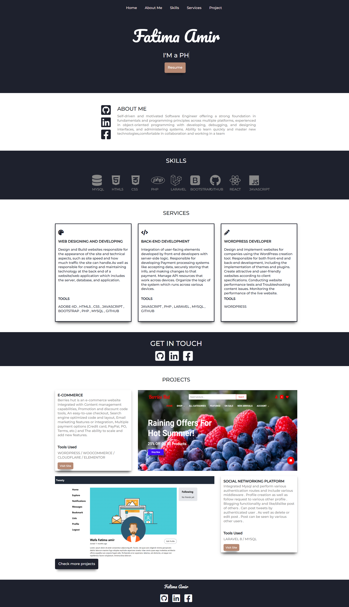

<!DOCTYPE html>
<html lang="en">
<head>
  <meta charset="UTF-8">
  <title>README - Personal Portfolio (PHP + JavaScript)</title>
  
</head>
<body>

  <h1>💼 Personal Portfolio Website</h1>

  
A responsive, modern personal portfolio website built entirely using <strong>raw PHP</strong> and <strong>JavaScript</strong>, with no frameworks.

  <h2>🌟 Features</h2>
  <ul>
    <li>Home, About Me, Projects, Contact pages</li>
    <li>Dynamic content loading with PHP includes</li>
    <li>Interactive UI with Vanilla JavaScript</li>
    <li>Contact form with backend email handling in PHP</li>
    <li>Responsive design for mobile and desktop</li>
    <li>Custom animations using JavaScript</li>
  </ul>

  <h2>📸 Screenshots</h2>

  <h3>Home Page</h3>
  

  <h2>🛠 Technologies Used</h2>
  <ul>
    <li>HTML5 / CSS3</li>
    <li>JavaScript (Vanilla)</li>
    <li>PHP (Raw / No Framework)</li>
    <li>Mail Functionality via <code>mail()</code> in PHP</li>
  </ul>

  <h2>🚀 How to Run the Project</h2>
  <ol>
    <li>Clone the repository:
      <pre><code>git clone https://github.com/wafafatima66/portfolio</code></pre>
    </li>
    <li>Place it in your local server directory (e.g., <code>htdocs</code> if using XAMPP).</li>
    <li>Start Apache server (and MySQL if your contact form stores data).</li>
    <li>Open <code>http://localhost/portfolio-php-js</code> in your browser.</li>
  </ol>

 
  <h2>📧 Contact</h2>
  
If you want to get in touch, feel free to connect via <a href="https://www.linkedin.com/in/fatimaamir99/" target="_blank">LinkedIn</a>

  <h3>⭐ If you like this project, please consider starring it on GitHub!</h3>

</body>
</html>
